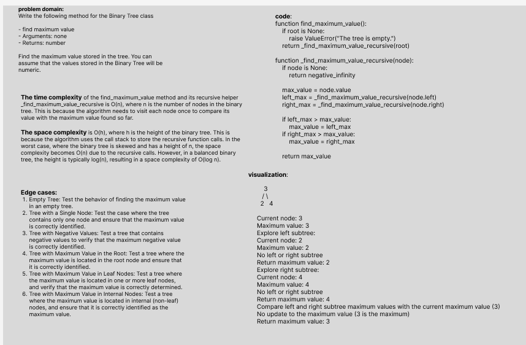

# Challenge Title: Find the Maximum Value in a Binary Tree
## Code Challenge: Class 16
## Feature Tasks

Write the following method for the Binary Tree class

-	find maximum value
-	Arguments: none
-	Returns: number

Find the maximum value stored in the tree. You can assume that the values stored in the Binary Tree will be numeric.

## Approach & Efficiency

- The time complexity of the find_maximum_value method and its recursive helper _find_maximum_value_recursive is O(n), where n is the number of nodes in the binary tree. This is because the algorithm needs to visit each node once to compare its value with the maximum value found so far.

   
- The space complexity is O(h), where h is the height of the binary tree. This is because the algorithm uses the call stack to store the recursive function calls. In the worst case, where the binary tree is skewed and has a height of n, the space complexity becomes O(n) due to the recursive calls. However, in a balanced binary tree, the height is typically log(n), resulting in a space complexity of O(log n).

## Solution
### [Code Link](./trees/Tree.py)
### [Test Code Link](./tests/test_tree.py)

To run the code:
-on your terminal follow these command:
1. python3 -m venv .venv
1. source .venv/bin/activate
2. pip install pytest or pip install -r requirements.txt
3. pytest 

after finishing write this command:
deactivate
