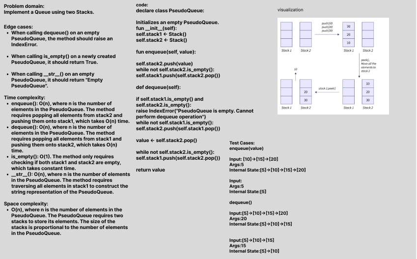

# Challenge Title: Implement a Queue using two Stacks
## Code Challenge: Class 11
## Feature Tasks
- Create a new class called pseudo queue.
    Internally, utilize 2 Stack instances to create and manage the queue
- Methods:
    1. enqueue
        Arguments: value
        Inserts a value into the PseudoQueue, using a first-in, first-out approach.
    2. dequeue
        Arguments: none
        Extracts a value from the PseudoQueue, using a first-in, first-out approach.
## Whiteboard Process

## Approach & Efficiency

- Time complexity :
    The time complexity of enqueue and dequeue methods is O(n), where n is the number of elements in the queue, because in both methods, in the first will move all the elements from one stack to another, which takes O(n) time, and then perform some constant time operations.
- Space complexity :
    The space complexity of enqueue and dequeue methods is O(n), because we are using two stacks to implement the queue, each of which can potentially hold n elements.

## Solution
### [Code Link](./StackAndQueue/PseudoQueue.py)
### [Test Code Link](./tests/test_PseudoQueue.py)

To run the code:
-on your terminal follow these command:
1. python3 -m venv .venv
1. source .venv/bin/activate
2. pip install pytest or pip install -r requirements.txt
3. pytest 

after finishing write this command:
deactivate
