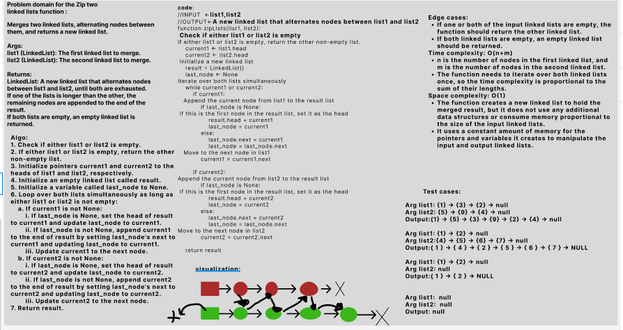

# Challenge Title: Linked List Implementation(Zip two linked lists.)
## Code Challenge: Class 08
## Feature Tasks
Write a function called zip lists
- Arguments: 2 linked lists
- Return: New Linked List, zipped as noted below
- Zip the two linked lists together into one so that the nodes alternate between the two lists and return a reference to the the zipped list.
## Whiteboard Process

## Approach & Efficiency
## Big O :

The time complexity is  O(n+m)

The space complexity is  O(1) 

## Solution
### [click here to go to the code](./LinkedList/LinkedList.py)
### [click here to go to the test code](./tests/test_ll.py)

To run the code:
-on your terminal follow these command:
1. source .venv/bin/activate
2. pip install pytest
3. pytest 

