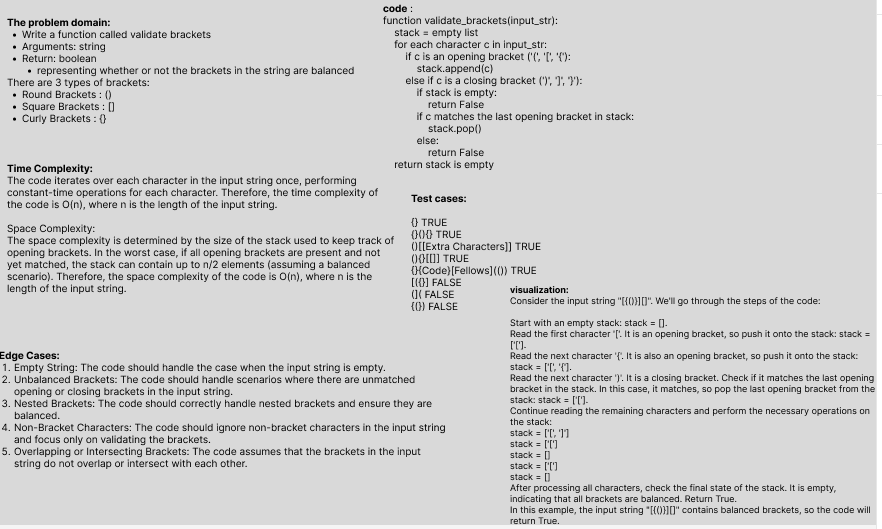

# Challenge Title: Multi-bracket Validation.
## Code Challenge: Class 13
## Feature Tasks
    Write a function called validate brackets
    Arguments: string
    Return: boolean
    representing whether or not the brackets in the string are balanced
## Whiteboard Process

## Approach & Efficiency

- Time complexity :
The code iterates over each character in the input string once, performing constant-time operations for each character. Therefore, the time complexity of the code is O(n), where n is the length of the input string.

- Space complexity :
The space complexity is determined by the size of the stack used to keep track of opening brackets. In the worst case, if all opening brackets are present and not yet matched, the stack can contain up to n/2 elements (assuming a balanced scenario). Therefore, the space complexity of the code is O(n), where n is the length of the input string.
## Solution
### [Code Link](./stack_queue_brackets/stack_queue_brackets.py)
### [Test Code Link](./tests/test_stack_queue_brackets.py)

To run the code:
-on your terminal follow these command:
1. python3 -m venv .venv
1. source .venv/bin/activate
2. pip install pytest or pip install -r requirements.txt
3. pytest 

after finishing write this command:
deactivate
