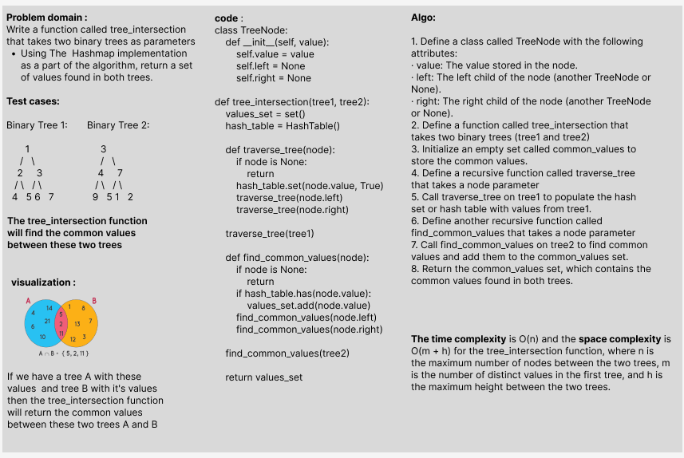

# Challenge Title: Find common values in 2 binary trees.

**_Write a function called tree_intersection that takes two binary trees as parameters._**
**_Using your Hashmap implementation as a part of your algorithm, return a set of values found in both trees. _**

## Whiteboard Process

## Approach & Efficiency

#### The time complexity is O(n) and the space complexity is O(m + h) for the tree_intersection function, where n is the maximum number of nodes between the two trees, m is the number of distinct values in the first tree, and h is the maximum height between the two trees.

## Solution
- **_[The Code Link](./tree_intersection/tree_intersection/tree_intersection.py)_**

- **_[The Test Code Link](./tests/test_tree_intersection.py)_**

- **To run the code :**

        python3 -m venv .venv

        source .venv/bin/activate
    
- **To run the Test:**

        pytest

