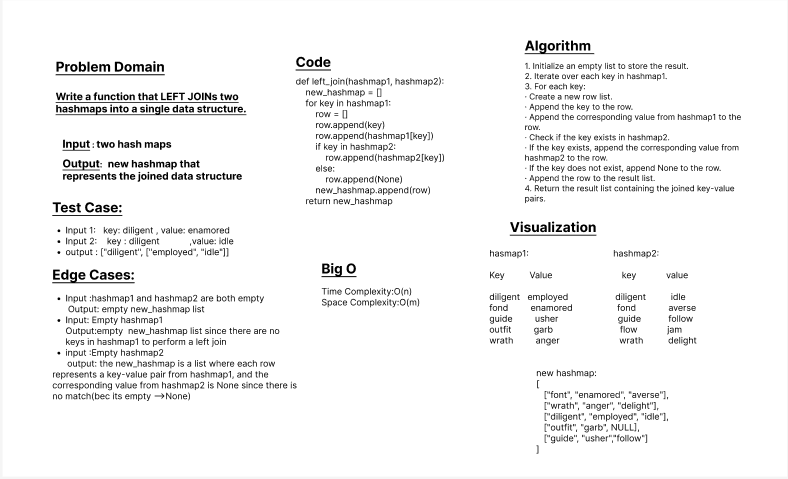

# Challenge Title: Implement a simplified LEFT JOIN for 2 Hashmaps.

- ***Write a function that LEFT JOINs two hashmaps into a single data structure.**
## Whiteboard Process

## Approach & Efficiency

The Approach :

        1.	Initialize an empty list to store the result.
        2.	Iterate over each key in hashmap1.
        3.	For each key:
        •	Create a new row list.
        •	Append the key to the row.
        •	Append the corresponding value from hashmap1 to the row.
        •	Check if the key exists in hashmap2.
        •	If the key exists, append the corresponding value from hashmap2 to the row.
        •	If the key does not exist, append None to the row.
        •	Append the row to the result list.
        4.	Return the result list containing the joined key-value pairs.
        

The Efficiency:

         The time complexity (Big O) is O(n), where n is the number of keys in hashmap1-->This is because the function iterates through each key in hashmap1 once.

         The space complexity is O(m), where m is the number of keys in hashmap1 for which a row is created. 

## Solution
- **_[The Code Link](./hashmapLeftJoin/hashmapLeftJoin.py)_**

- **_[The Test Code Link](./tests/test_hashmap_left_join.py)_**

- **To run the code :**

        python3 -m venv .venv

        source .venv/bin/activate
    
- **To run the Test:**

        pytest

