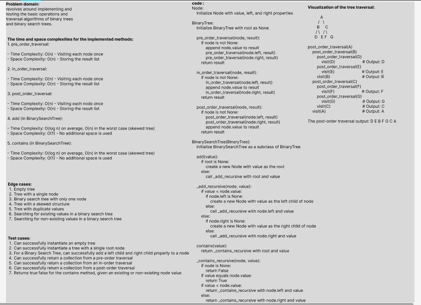

# Challenge Title: Binary Tree and BST Implementation.
## Code Challenge: Class 15: Binary Tree and BST Implementation
## Feature Tasks
Node
-	Create a Node class that has properties for the value stored in the node, the left child node, and the right child node.

Binary Tree
-	Create a Binary Tree class
-	Define a method for each of the depth first traversals:
-	pre order
-	in order
-	post order
-	Each depth first traversal method should return an array of values, ordered appropriately.

Binary Search Tree
-	Create a Binary Search Tree class
-	This class should be a sub-class (or your languages equivalent) of the Binary Tree Class, with the following additional methods:
-	Add
-	Arguments: value
-	Return: nothing
-	Adds a new node with that value in the correct location in the binary search tree.
-	Contains
-	Argument: value
-	Returns: boolean indicating whether or not the value is in the tree at least once.

       

## Approach & Efficiency

1.  pre_order_traversal:

    - Time Complexity: O(n) - Visiting each node once
    - Space Complexity: O(n) - Storing the result list

2.  in_order_traversal:

    - Time Complexity: O(n) - Visiting each node once
    - Space Complexity: O(n) - Storing the result list

3. post_order_traversal:

    - Time Complexity: O(n) - Visiting each node once
    - Space Complexity: O(n) - Storing the result list

4.  add (in BinarySearchTree):

    - Time Complexity: O(log n) on average, O(n) in the worst case (skewed tree)
    - Space Complexity: O(1) - No additional space is used

5. contains (in BinarySearchTree):

    - Time Complexity: O(log n) on average, O(n) in the worst case (skewed tree)
    - Space Complexity: O(1) - No additional space is used
## Solution
### [Code Link](./trees/Tree.py)
### [Test Code Link](./tests/test_tree.py)

To run the code:
-on your terminal follow these command:
1. python3 -m venv .venv
1. source .venv/bin/activate
2. pip install pytest or pip install -r requirements.txt
3. pytest 

after finishing write this command:
deactivate
