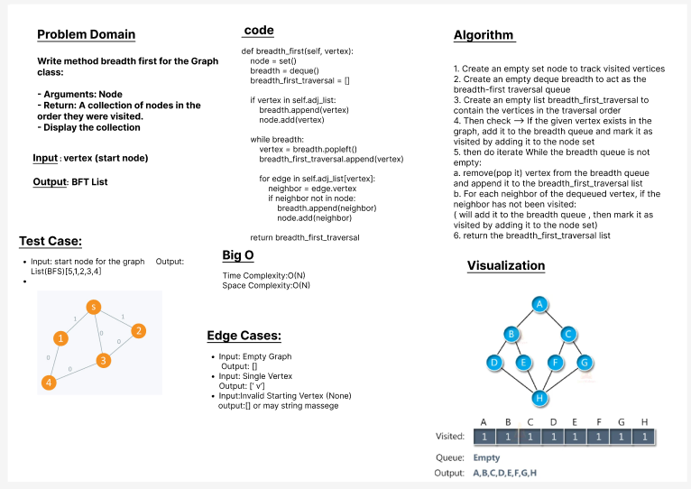

# Challenge Title:  Implement a breadth-first traversal on a graph.

Write method **breadth first** for the Graph class:

- Arguments: Node
- Return: A collection of nodes in the order they were visited.
- Display the collection

## Whiteboard Process

## Approach & Efficiency

Approach:

        1. Create an empty set node to track visited vertices
        2. Create an empty deque breadth to act as the breadth-first traversal queue
        3. Create an empty list breadth_first_traversal to contain the vertices in the traversal order
        4. Then check --> If the given vertex exists in the graph, add it to the breadth queue and mark it as visited by adding it to the node set
        5. then do iterate While the breadth queue is not empty:
            a. remove(pop it) vertex from the breadth queue and append it to the breadth_first_traversal list
            b. For each neighbor of the dequeued vertex, if the neighbor has not been visited:
               ( will add it to the breadth queue , then mark it as visited by adding it to the node set)
        6. return the breadth_first_traversal list 

Efficiency:

        The time complexity is dependent on the number of vertices (V) and edges (E) in the graph so in our case  each vertex and edge will be visited once, will end with linear time complexity O(N) or O(V) or we can write it O(N+E)

        The space complexity is determined by the additional data structures used during the traversal so in our case, we use the node set to track visited vertices and the breadth deque to store the vertices in the queue so the maximum space required is proportional to the number of vertices (V) in the graph, will end with O(V) as space complexity 
## Solution
- **_[The Code Link](./graph/graph.py)_**

- **_[The Test Code Link](./tests/test_graph.py)_**

- **To run the code :**

        python3 -m venv .venv

        source .venv/bin/activate
    
- **To run the Test:**

        pytest

