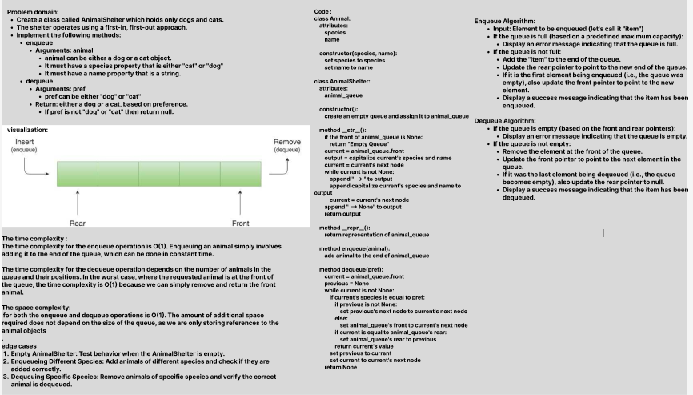

# Challenge Title: First-in, First out Animal Shelter.
## Code Challenge: Class 12
## Feature Tasks

- Create a class called AnimalShelter which holds only dogs and cats.
- The shelter operates using a first-in, first-out approach.
- Implement the following methods:
1. enqueue
   Arguments: animal
    animal can be either a dog or a cat object.
    It must have a species property that is either "cat" or "dog"
    It must have a name property that is a string.
2. dequeue
    Arguments: pref
    pref can be either "dog" or "cat"
    Return: either a dog or a cat, based on preference.
    If pref is not "dog" or "cat" then return null.
       

## Approach & Efficiency

- Time complexity :
    The time complexity for the enqueue operation  is O(1). Enqueuing an animal simply involves adding it to the end of the queue, which can be done in constant time.

    The time complexity for the dequeue operation depends on the number of animals in the queue and their positions. In the worst case, where the requested animal is at the front of the queue, the time complexity is O(1) because we can simply remove and return the front animal. 
   
- Space complexity :
    The space complexity for both the enqueue and dequeue operations is O(1). The amount of additional space required does not depend on the size of the queue, as we are only storing references to the animal objects.

## Solution
### [Code Link](./%20Animal_Shelter/AnimalShelter.py)
### [Test Code Link](./%20Animal_Shelter/test_AnimalShelter.py)

To run the code:
-on your terminal follow these command:
1. python3 -m venv .venv
1. source .venv/bin/activate
2. pip install pytest or pip install -r requirements.txt
3. pytest 

after finishing write this command:
deactivate
