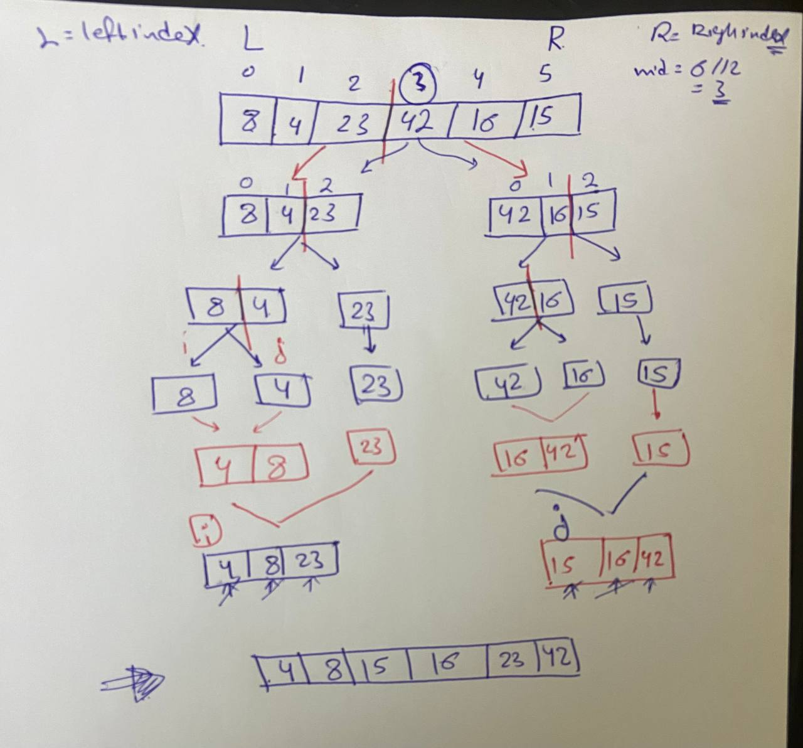

***_Merge Sort_**

 Merge sort is one of the most efficient sorting algorithms. It is based on the divide-and-conquer strategy. Merge sort continuously cuts down a list into multiple sublists until each has only one item, then merges those sublists into a sorted list.

 Will trace this array:[8,4,23,42,16,15]:

 

