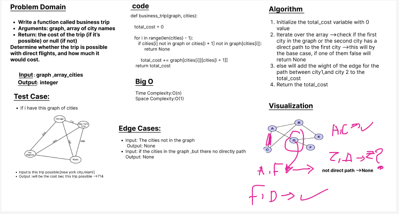

# Challenge Title:  business trip

### Given a business trip itinerary, and an Alaska Airlines route map, is the trip possible with direct flights? If so, how much will the total trip cost be?

## Write a function called **business trip**
- Arguments: graph, array of city names
- Return: the cost of the trip (if it’s possible) or null (if not)
- Determine whether the trip is possible with direct flights, and how much it would cost.

## Whiteboard Process

## Approach & Efficiency

Approach:

Efficiency:

## Solution
- **_[The Code Link](./graph/graphbusinesstrip.py)_**

- **_[The Test Code Link](./tests/test_graph.py)_**

- **To run the code :**

        python3 -m venv .venv

        source .venv/bin/activate
    
- **To run the Test:**

        pytest

