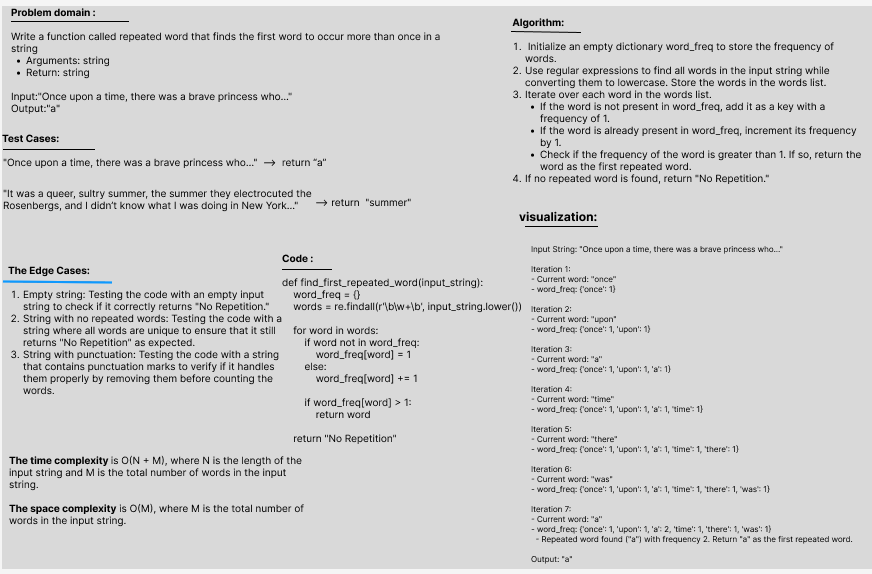

# Challenge Title: Find the first repeated word in a book.
## Write a function called repeated word that finds the first word to occur more than once in a string
## - Arguments: string
## - Return: string
## Whiteboard Process

## Approach & Efficiency

1.	Initialize an empty dictionary called word_freq to store the frequency of words.
2.	Use regular expressions to find all words in the input string while converting them to lowercase. Store the words in the words list.
3.	Iterate over each word in the words list.
4.	If the word is not present in the word_freq dictionary, add it as a key with a frequency of 1.
5.	If the word is already present in the word_freq dictionary, increment its frequency by 1.
6.	Check if the frequency of the word is greater than 1. If so, return the word as the first repeated word.
7.	If no repeated word is found after iterating through all words, return the string "No Repetition".

### The time complexity of find_first_repeated_word is O(n + m), and the space complexity is O(m), where n is the length of the input string and m is the number of words in the input string.

## Solution
[The Code Link](./hashtable/hashtable/HashmapRepeatedWord.py)
[The Test Code Link](./tests/test_find_first_repeated_word.py)

- To run the code :

    python3 -m venv .venv

    source .venv/bin/activate
    
- To run the Test:

    pytest

