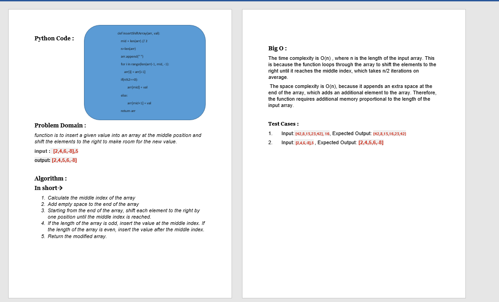
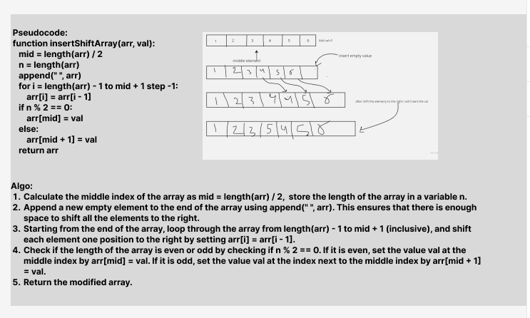
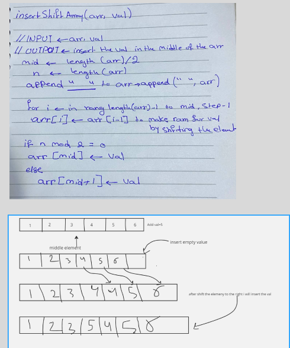

# Challenge Title: Insert and shift an array in middle at index
## Code Challenge: Class 02
## Feature Tasks
Write a function called insertShiftArray which takes in an array and a value to be added. Without utilizing any of the built-in methods available to your language, return an array with the new value added at the middle index.
## Whiteboard Process

## Approach & Efficiency
## Algorithm :

**In short**
1.	Calculate the middle index of the array
2.	Add empty space to the end of the array
3.	Starting from the end of the array, shift each element to the right by one position until the middle index is reached
4.	If the length of the array is odd, insert the value at the middle index. If the length of the array is even, insert the value after the middle index
5.	Return the modified array

## Big O :
The time complexity is O(n) , where n is the length of the input array. This is because the function loops through the array to shift the elements to the right until it reaches the middle index, which takes n/2 iterations on average.

 The space complexity is O(n), because it appends an extra space at the end of the array, which adds an additional element to the array. Therefore, the function requires additional memory proportional to the length of the input array.

## Solution
### [click here to go to the code](./insertShiftArray/insertShiftArray.py)
### [click here to go to the test code](./tests/test_insertShiftArray.py)

Test Cases :
1.	Input:[2,4,6,-8], 5 , Expected Output:	[2,4,5,6,-8]
2.	Input: [42,8,15,23,42], 16	 , Expected Output: [42,8,15,16,23,42]
3.	Input: [5], Expected Output: [5]
4.	Input: [], Expected Output: []

To run the code:
-on your terminal follow these command:
1. source .venv/bin/activate
2. pip install pytest
3. pytest
