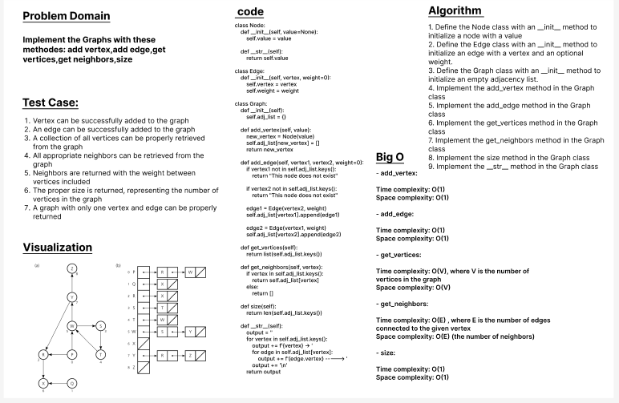

# Challenge Title:  Graphs Implementation

- Implement the Graphs with these methodes: add vertex,add edge,get vertices,get neighbors,size

## Whiteboard Process

## Approach & Efficiency

        - add_vertex:

        Time complexity: O(1)
        Space complexity: O(1)

        - add_edge:

        Time complexity: O(1)
        Space complexity: O(1)

        - get_vertices:

        Time complexity: O(V), where V is the number of vertices in the graph
        Space complexity: O(V)

        - get_neighbors:

        Time complexity: O(E) , where E is the number of edges connected to the given vertex
        Space complexity: O(E) (the number of neighbors)

        - size:

        Time complexity: O(1)
        Space complexity: O(1)

## Solution
- **_[The Code Link](./graph/graph.py)_**

- **_[The Test Code Link](./tests/test_graph.py)_**

- **To run the code :**

        python3 -m venv .venv

        source .venv/bin/activate
    
- **To run the Test:**

        pytest

