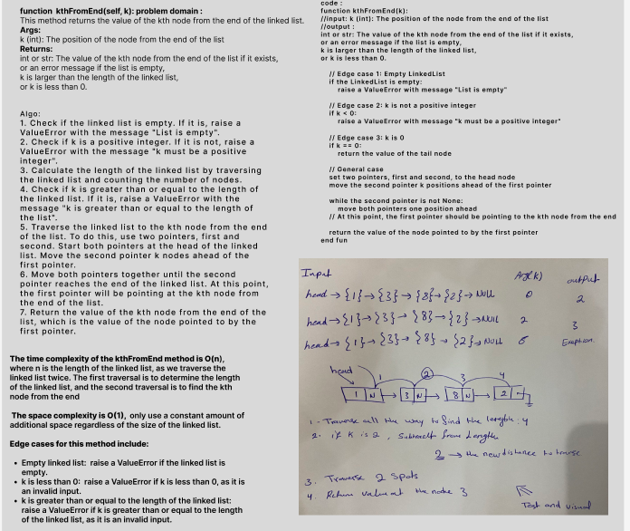

# Challenge Title: Linked List Implementation(k-th value from the end of a linked list.)
## Code Challenge: Class 07
## Feature Tasks
Write the following methods for the Linked List class:
- kth from end -> This method returns the value of the kth node from the end of the linked list ,it takes  Args:
        k (int): The position of the node from the end of the list (k=0 returns the last node, k=1 returns the second last node, and so on).

## Whiteboard Process

## Approach & Efficiency
## Big O :

The time complexity is  O(n)

The space complexity is  O(1) 

## Solution
### [click here to go to the code](./LinkedList/LinkedList.py)
### [click here to go to the test code](./tests/test_ll.py)

To run the code:
-on your terminal follow these command:
1. source .venv/bin/activate
2. pip install pytest
3. pytest or pytest

