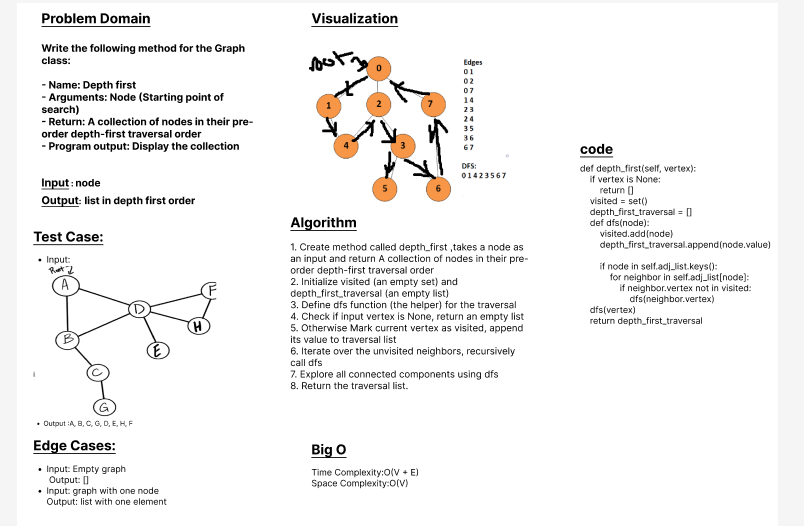

# Challenge Title: Implementation a depth first pre-order traversal on graph
## Write the following method for the Graph class:

- Name: Depth first
- Arguments: Node (Starting point of search)
- Return: A collection of nodes in their pre-order depth-first traversal order
- Program output: Display the collection

## Whiteboard Process

## Approach & Efficiency

Approach:

        1.	Create method called depth_first ,takes a node as an input and return A collection of nodes in their pre-order depth-first traversal order

        2.	Initialize visited (an empty set) and depth_first_traversal (an empty list)

        3.	Define dfs function (the helper) for the traversal

        4.	Check if input vertex is None, return an empty list

        5.	Otherwise Mark current vertex as visited, append its value to traversal list

        6.	Iterate over the unvisited neighbors, recursively call dfs

        7.	Explore all connected components using dfs

        8.	Return the traversal list.

Efficiency:

        - Time Complexity: O(V + E) or O(N) where V or N is the number of vertices and E is the number of edges in the graph

        - Space Complexity: O(V) or O(N) due to the recursion stack and the additional space used.

## Solution
- **_[The Code Link](./graph/graph.py)_**

- **_[The Test Code Link](./tests/test_graph.py)_**

- **To run the code :**

        python3 -m venv .venv

        source .venv/bin/activate
    
- **To run the Test :**

        pytest

