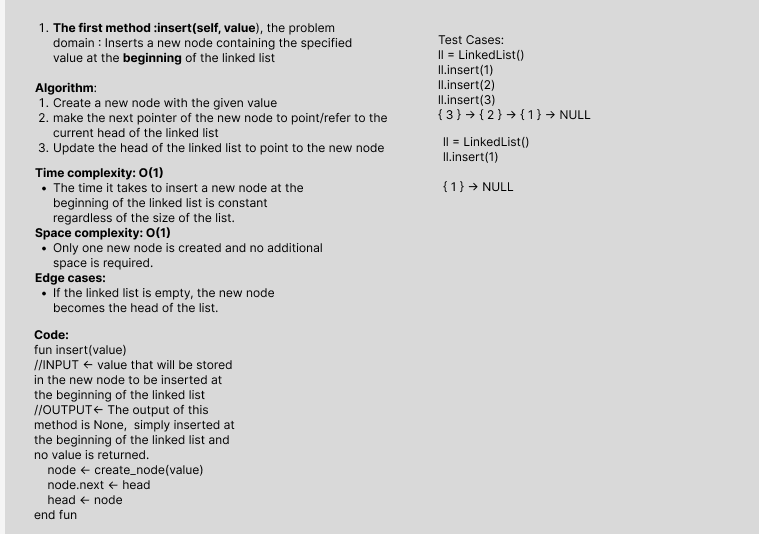
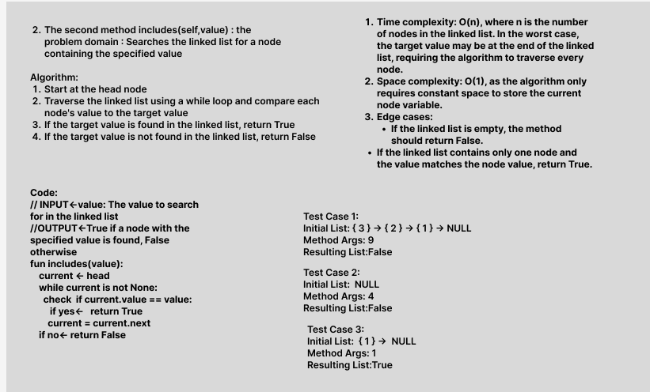
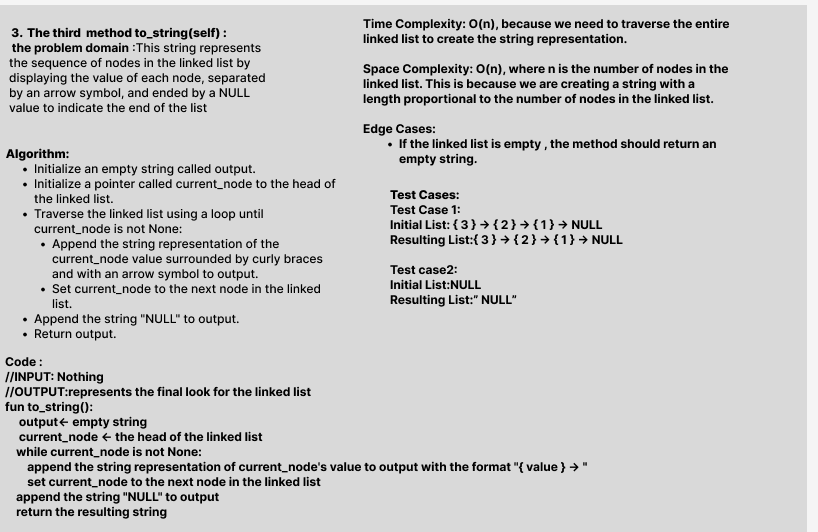

# Challenge Title: Linked List Implementation
## Code Challenge: Class 05 
## Feature Tasks
Write the following methods for the Linked List class:

- insert -> Inserts a new node containing the specified value at the **beginning** of the linked list, it takes Args value that represent The value to be stored in the new node.
- includes-> Searches the linked list for a node containing the specified value, it takes Args value The value to search for in the linked list
- to_string-> a string representation of the linked list in the following format:
        'LinkedList: {value1} -> {value2} -> ... -> {valueN} -> NULL'
        where {value1}, {value2}, ..., {valueN} are the data values of each node in the linked list
        If the linked list is empty, it returns 'Empty LinkedList'
## Whiteboard Process

## Approach & Efficiency
## Big O :
- For the first method :insert Time complexity : O(1) Space complexity : O(1)

- For the second method :includes Time complexity : O(n) Space complexity : O(1)

- For the thared method :to_string Time complexity : O(n) Space complexity : O(1)

## Solution
### [click here to go to the code](./LinkedList/LinkedList.py)
### [click here to go to the test code](./tests/test_ll.py)

To run the code:
-on your terminal follow these command:
1. source .venv/bin/activate
2. pip install pytest
3. pytest or pytest -s
