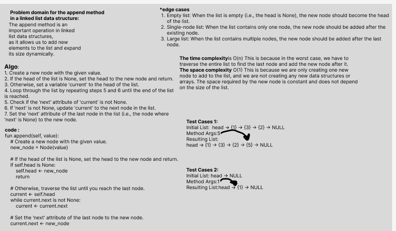

# Challenge Title: Linked List Implementation(Extending an Implementation)
## Code Challenge: Class 06 
## Feature Tasks

Write the following methods for the Linked List class:
- append ->This method creates a new node with the specified value and adds it to the end of the linked list.
- insert before->Adds a new node containing the specified new value before the first occurrence of a node with the specified value in the linked list.
- insert after-> Adds a new node containing the specified new value after the first occurrence of a node with the specified value in the linked list.

## Whiteboard Process

## Approach & Efficiency

## Big O :
- **For the first method :append** 
     Time complexity : O(n) Space complexity : O(1)

- **For the second method :insert before** 

     Time complexity : O(n) Space complexity : O(1)

- **For the thared method :insert after** 
     Time complexity : O(n) Space complexity : O(1)

## Solution
### [click here to go to the code](./LinkedList/LinkedList.py)
### [click here to go to the test code](./tests/test_ll.py)

To run the code:
-on your terminal follow these command:
1. source .venv/bin/activate
2. pip install pytest
3. pytest or pytest -s
