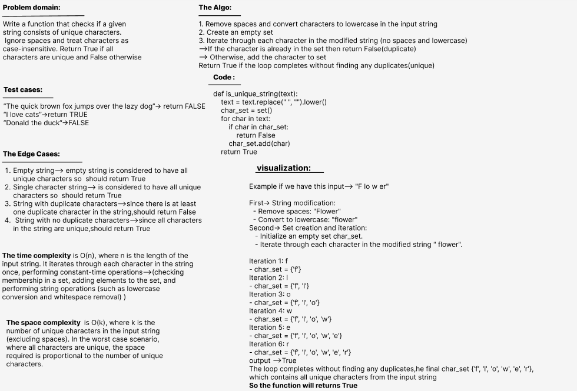

# Challenge Title: Determine if a string is full of unique characters.

**_Write a function that checks if a given string consists of unique characters. Ignore spaces and treat characters as case-insensitive. Return True if all characters are unique and False otherwise._**
## Whiteboard Process

## Approach & Efficiency

#### The time complexity is of O(n), where n is the length of the input string. It iterates through each character in the string once, performing constant-time operations-->(checking membership in a set, adding elements to the set, and performing string operations (such as lowercase conversion and whitespace removal) )

#### The space complexity of the function is O(k), where k is the number of unique characters in the input string (excluding spaces). In the worst case scenario, where all characters are unique, the space required is proportional to the number of unique characters.
## Solution
- **_[The Code Link](./unique_string/unique_string.py)_**

- **_[The Test Code Link](./tests/test_unique_string.py)_**

- **To run the code :**

        python3 -m venv .venv

        source .venv/bin/activate
    
- **To run the Test:**

        pytest

