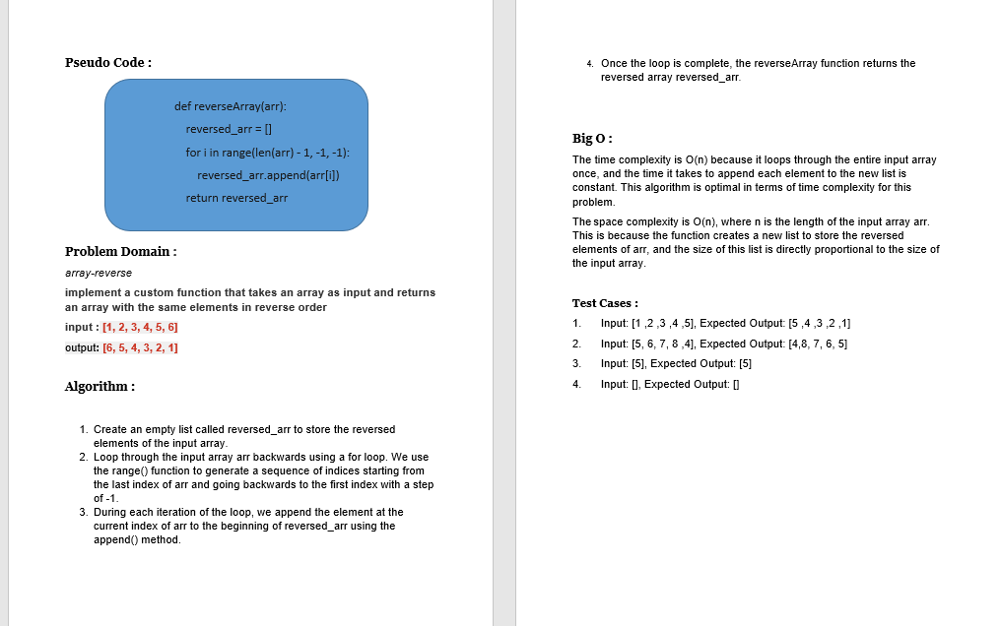
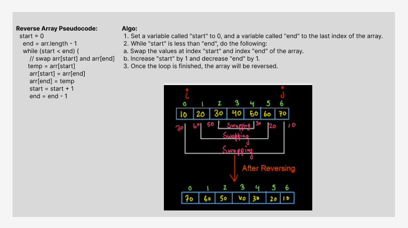

# Challenge Title: Array Reverse
## Code Challenge: Class 01
## Feature Tasks
Write a function called reverseArray which takes an array as an argument. Without utilizing any of the built-in methods available to your language, return an array with elements in reversed order.
## Whiteboard Process

## Approach & Efficiency
## Algorithm :

1.	Create an empty list called reversed_arr to store the reversed elements of the input array.
2.	Loop through the input array arr backwards using a for loop. We use the range() function to generate a      sequence of indices starting from the last index of arr and going backwards to the first index with a step of -1.
3.	During each iteration of the loop, we append the element at the current index of arr to the beginning of reversed_arr using the append() method.
4.	Once the loop is complete, the reverseArray function returns the reversed array reversed_arr.

## Big O :
The time complexity is O(n) because it loops through the entire input array once, and the time it takes to append each element to the new list is constant. This algorithm is optimal in terms of time complexity for this problem.

The space complexity is O(n), where n is the length of the input array arr. This is because the function creates a new list to store the reversed elements of arr, and the size of this list is directly proportional to the size of the input array.

## Solution
### [click here to go to the code](./ArrayReverse/ArrayReverse.py)
### [click here to go to the test code](./tests//test_ArrayReverse.py)

Test Cases :
1.	Input: [1 ,2 ,3 ,4 ,5], Expected Output: [5 ,4 ,3 ,2 ,1] 
2.	Input: [5, 6, 7, 8 ,4], Expected Output: [4,8, 7, 6, 5] 
3.	Input: [5], Expected Output: [5]
4.	Input: [], Expected Output: []

To run the code:
-on your terminal follow these command:
1. source .venv/bin/activate
2. pip install pytest
3. pytest
 - [x] Top-level README “Table of Contents” is updated
 - [x] README for this challenge is complete
 - [x] Summary, Description, Approach & Efficiency, Solution
 - [x] Picture of whiteboard
 - [x] Link to code
 - [x] Feature tasks for this challenge are completed
 - [x] Unit tests written and passing
 - [x] “Happy Path” - Expected outcome
 - [x] Expected failure
 - [x] Edge Case (if applicable/obvious)