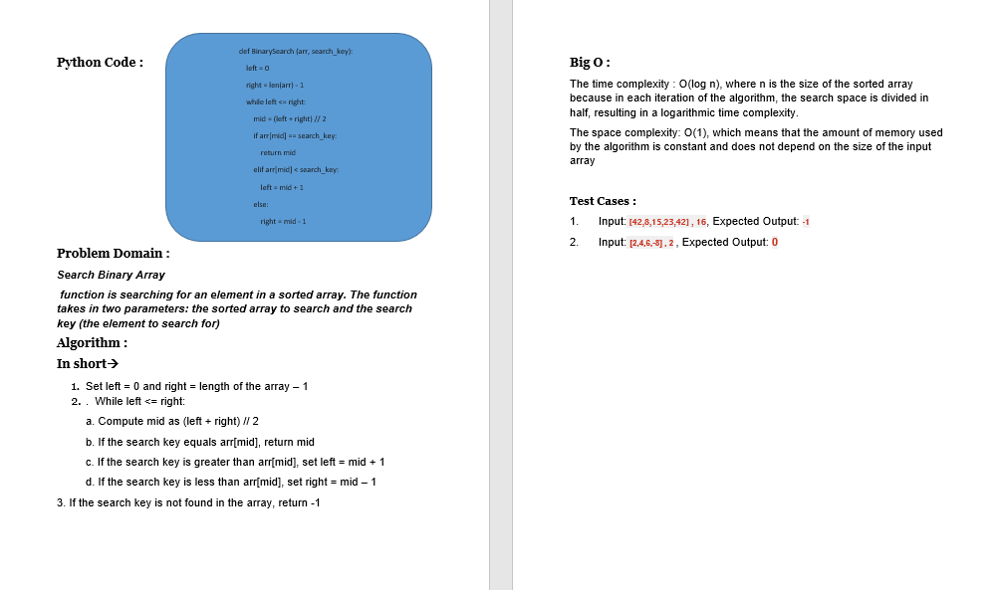
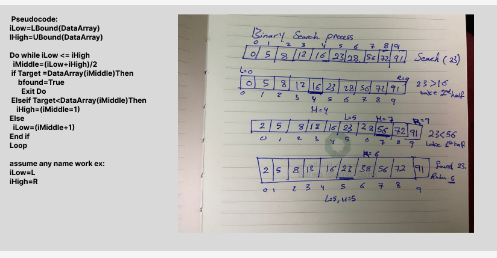

# Challenge Title: Binary search in a sorted 1D array
## Code Challenge: Class 03
## Feature Tasks
Write a function called BinarySearch which takes in 2 parameters: a sorted array and the search key. Without utilizing any of the built-in methods available to your language, return the index of the array’s element that is equal to the value of the search key, or -1 if the element is not in the array.
## Whiteboard Process

## Approach & Efficiency
## Algorithm :

**In short**
1.	Set left = 0 and right = length of the array – 1
2.	 While left <= right:
    a. Compute mid as (left + right) // 2
    b. If the search key equals arr[mid], return mid
    c. If the search key is greater than arr[mid], set left = mid + 1
    d. If the search key is less than arr[mid], set right = mid – 1
3. If the search key is not found in the array, return -1

## Big O :

The time complexity : O(log n), where n is the size of the sorted array  because in each iteration of the algorithm, the search space is divided in half, resulting in a logarithmic time complexity

The space complexity: O(1), which means that the amount of memory used by the algorithm is constant and does not depend on the size of the input array

## Solution
### [click here to go to the code](./arrayBinarySearch/arrayBinarySearch.py)
### [click here to go to the test code](./tests/test_arrayBinarySearch.py)

Test Cases :

1.	Input: [42,8,15,23,42], 16, Expected Output: -1
2.	Input: [2,4,6,-8],2 , Expected Output: 0

To run the code:
-on your terminal follow these command:
1. source .venv/bin/activate
2. pip install pytest
3. pytest

 - [x] Top-level README “Table of Contents” is updated
 - [x] README for this challenge is complete
 - [x] Summary, Description, Approach & Efficiency, Solution
 - [x] Picture of whiteboard
 - [x] Link to code
 - [x] Feature tasks for this challenge are completed
 - [x] Unit tests written and passing
 - [x] “Happy Path” - Expected outcome
 - [x] Expected failure
 - [x] Edge Case (if applicable/obvious)